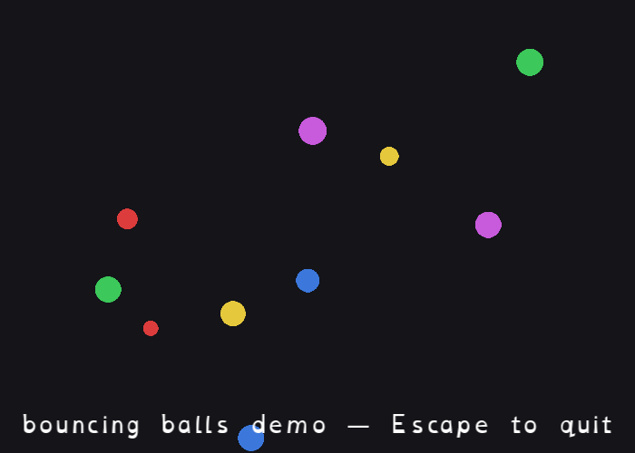

[← Back to catalog](../index.html)

# Bouncing Balls

A handful of colored circles bounce around the window, off every edge.
Pure animation — no buttons, no text input.

Each ball is the same alpha-blended circle image (`assets/ball.bmp`), tinted
a different color at draw time rather than drawn as separate textures.

## Controls

- Escape: quit

## Run it

- Go installed: `go run ./cmd/bouncing-balls` (from the repo root)
- Windows, no Go needed: double-click `exe/bouncing-balls-start-exe.cmd`
