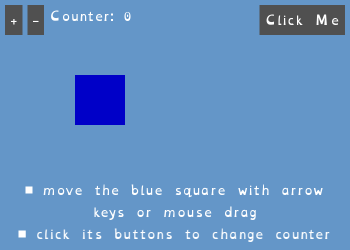

[← Back to catalog](../index.html)

# Counter Demo

A draggable rectangle, `+`/`-` buttons that update a counter, and a modal
alert dialog with word-wrapped text.

## Controls

- Arrow keys or mouse-drag: move the blue square
- Click `+` / `-`: change the counter
- Click "Click Me": open the alert dialog
- Escape / Space / click: dismiss the alert, or quit if none is showing

## Run it

- Go installed: `go run ./cmd/counter-demo` (from the repo root)
- Windows, no Go needed: double-click `exe/app-start-exe.cmd`
