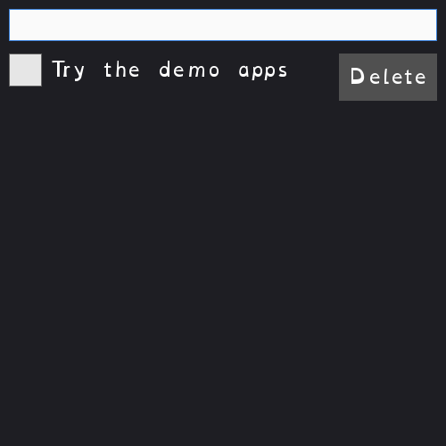

[← Back to catalog](../index.html)

# CRUD App

A small to-do list: type a new item and press Enter to add it, click a
checkbox to mark it done, click Delete to remove it. Everything is saved to
a JSON file (`crud-app-data.json`) next to the program, so your list is
still there next time you run it.

## Controls

- Type + Enter: add a new item
- Click a checkbox: toggle done/not-done (saved immediately)
- Click Delete: remove that row (saved immediately)
- Escape: quit

## Run it

- Go installed: `go run ./cmd/crud-app` (from the repo root)
- Windows, no Go needed: double-click `exe/crud-app-start-exe.cmd`
