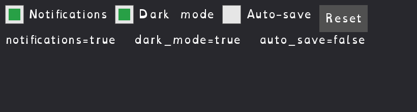

[← Back to catalog](../index.html)

# Form Demo

A small settings screen: checkboxes, a status line that updates live as you
toggle them, and a Reset button.

## Controls

- Click a checkbox: toggle it, status line updates
- Click Reset: clears all checkboxes
- Escape: quit

## Run it

- Go installed: `go run ./cmd/form-demo` (from the repo root)
- Windows, no Go needed: double-click `exe/form-demo-start-exe.cmd`
