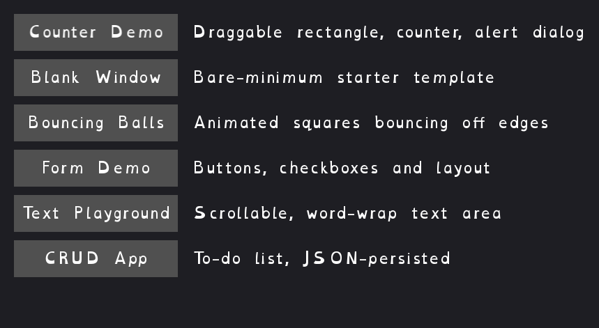

[← Back to catalog](../index.html)

# Launcher

A picker for every other app in this catalog: one button per app, with a
short description next to each. Click a button and that app opens in its
own window — the launcher stays open, so you can click another one right
after.

## Controls

- Click a button: launches that app as a separate window
- Escape: quit the launcher (apps you already launched keep running)

## Run it

- Go installed: `go run ./cmd/launcher` (from the repo root)
- Windows, no Go needed: double-click `exe/launcher-start-exe.cmd`
- Already built? From the repo root: `./launcher`
