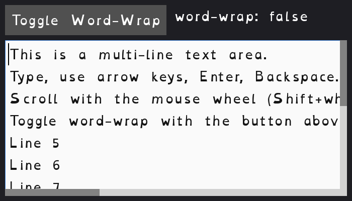

[← Back to catalog](../index.html)

# Text Playground

A scrollable, multi-line text box. Type into it, scroll with the mouse
wheel or by dragging the scrollbar handles, and toggle word-wrap on/off
with the button at the top.

## Controls

- Type normally to enter text
- Arrow keys, Home, End: move the cursor
- Backspace: delete
- Mouse wheel, or click-and-drag the scrollbar handles: scroll (vertical
  and, when word-wrap is off, horizontal)
- "Toggle Word-Wrap" button: switch between horizontal scrolling and
  wrapping long lines
- Escape: quit

## Run it

- Go installed: `go run ./cmd/text-playground` (from the repo root)
- Windows, no Go needed: double-click `exe/text-playground-start-exe.cmd`
