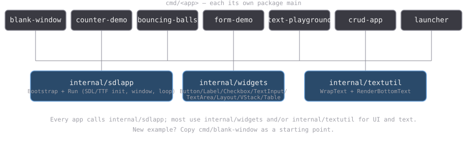

# Go + SDL3 example apps

This repo is a small collection of desktop apps written in Go, using
[SDL3](https://www.libsdl.org/) for the window, drawing, and keyboard/mouse
input. In plain terms: each app opens a window, draws some shapes/text into
it, and reacts to clicks and key presses — no browser, no HTML, just a
regular native program.

The Go bindings come from
[purego-sdl3](https://github.com/jupiterrider/purego-sdl3), which talks to
the SDL3 library directly without needing a C compiler (via
[purego](https://github.com/ebitengine/purego)).

Every app below shares the same small toolkit, kept in this repo under
`internal/`, so none of them start from scratch. See
[Project layout](#project-layout) below for how that fits together.

## Running an app

Two ways to run any app in this list, whichever suits you:

- **Have Go installed?** From the repo root: `go run ./cmd/<name>`
  (e.g. `go run ./cmd/blank-window`).
- **Just want to double-click and go, no Go install needed (Windows)?**
  Open the `exe/` folder and double-click `<name>-start-exe.cmd`
  (e.g. `blank-window-start-exe.cmd`). It runs the matching `.exe` with the
  SDL3 DLLs already sitting next to it in that folder.

There's also a **Launcher** app that lists every other app as a button — run
that once and click your way to any of the others instead of remembering
names. See its own page below.

## The apps

Each app has its own page with a screenshot, controls, and how to run it.

- [Counter Demo](apps/counter-demo.html) — draggable rectangle, counter
  buttons, modal alert dialog.
- [Blank Window](apps/blank-window.html) — the bare-minimum starter
  template for a new example.
- [Bouncing Balls](apps/bouncing-balls.html) — animated circles bouncing
  off the window edges.
- [Form Demo](apps/form-demo.html) — checkboxes, a live status line, and a
  Reset button.
- [Text Playground](apps/text-playground.html) — a scrollable, word-wrap
  toggleable multi-line text box.
- [CRUD App](apps/crud-app.html) — a to-do list with add/toggle/delete,
  saved to a JSON file.
- [Launcher](apps/launcher.html) — one button per app above, click to open.

## Project layout

- `internal/sdlapp` — `Bootstrap`/`Run`: opens the SDL/TTF window+renderer
  and drives the standard poll-events-then-render loop. Every app calls this.
- `internal/widgets` — the small UI toolkit: `Button`, `Label`, `Checkbox`,
  `TextInput`, `TextArea`, and three ways to arrange them —
  `Layout` (a horizontal row), `VStack` (a vertical column), and `Table` (a
  2D grid that aligns column widths and row heights automatically).
- `internal/textutil` — word-wrapping and centered-text rendering helpers.
- `cmd/blank-window` — the starter template. Copy this directory to begin a
  new example.

### How the widget/event system works

- **Layout is chosen up front, not per frame.** `Layout`/`VStack` position
  each widget as soon as it's added. `Table` is two-phase instead — add
  every row first, then call `Layout()` once — because a column's width
  depends on the widest widget in *every* row, not just the one being added.
  Since positions are fixed at construction (not re-flowed every frame),
  anything that sizes a window from its content has to use real values —
  two bugs this session came from measuring a placeholder (an empty status
  label, an unstretched table column) instead of the real content.
- **Events are dispatched with first-hit-wins, no capture/bubbling.** Every
  widget implements `Update(event, mx, my) bool`, returning `true` if it
  handled the event. A container (`Layout`/`VStack`/`Table`) just tries its
  children in order and stops at the first one that returns `true`. There's
  no focus stack beyond what a widget tracks itself — `TextInput`/`TextArea`
  keep their own `Focused` flag and start/stop OS text input on change.

## A note on the Windows DLLs in `exe/`

The `.dll` files in `exe/` are loaded by name at runtime (via `purego`, not
a static link), so an `.exe` built today isn't locked to today's exact DLL
build. If `exe/*.dll` ever looks stale or mismatched, dropping in newer
SDL3/SDL3_ttf builds should keep every existing `.exe` working without a
rebuild.
